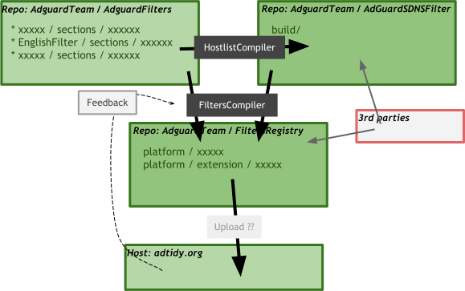
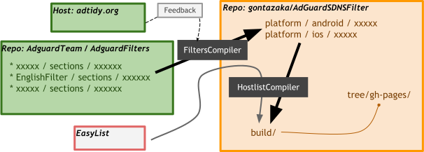

# 技術情報

## フィルター生成のワークフロー
### フォーク元

AdGuardがリリース（ディストリビュート？）するフィルターは次のように行われているもよう。

1. リポジトリ`AdguardTeam/AdguardFilters`でメンテナーがルール管理
2. リポジトリ`AdguardTeam/AdGuardSDNSFilter`でHostlistCompilerを使いDNSブロック用ルールを*1*やサードパーティーフィルターより生成
3. リポジトリ`AdguardTeam/FiltersRegistry`でFiltersCompilerを使い*1,2*よりプラットフォーム選別やアプリケーション用セットを生成。統計情報による最適化(optimized)版もここで生成
4. `adtidy.org`でAdGuardプロダクト用メタデータと共にフィルターファイルホスティング

### このリポジトリ

AdGuardが提供する`XX_optimized.txt`はDNS Filterに不要なルールも大量に含有されており、そのままHostlistCompilerを使ってもほしい結果は得られない。次のように行う。

1. Fork元と同様
2. FiltersCompilerを使い*1*よりDNS Filterに必要なファイルのみを対象に、プラットフォーム選別や統計情報による最適化(optimized)版を生成
3. HostlistCompilerを使いDNSブロック用ルールを*2*やサードパーティーフィルターより生成
4. GitHubでフィルターファイルホスティング
